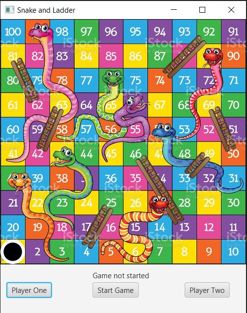

# Snake-and-Ladder

## Overview
Snake and ladder is a simple game consists of snakes and ladders. The object of the game is to navigate one's game piece, according to die rolls, from the start (bottom square) to the finish (top square), helped or hindered by ladders and snakes respectively.

This game is developed using Java and the GUI is designed using JavaFX.

